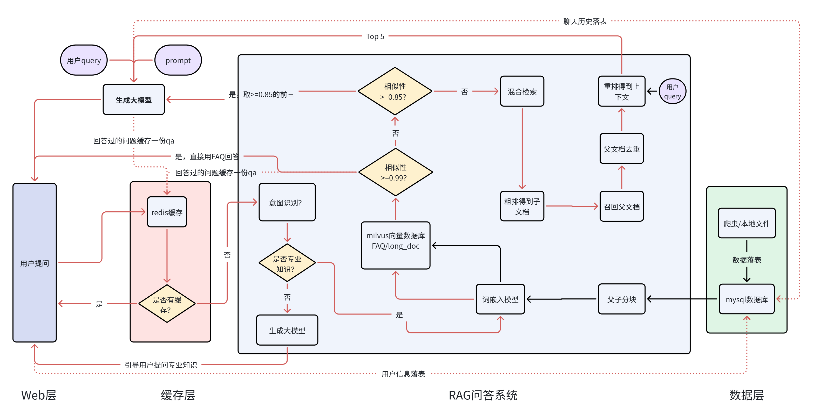
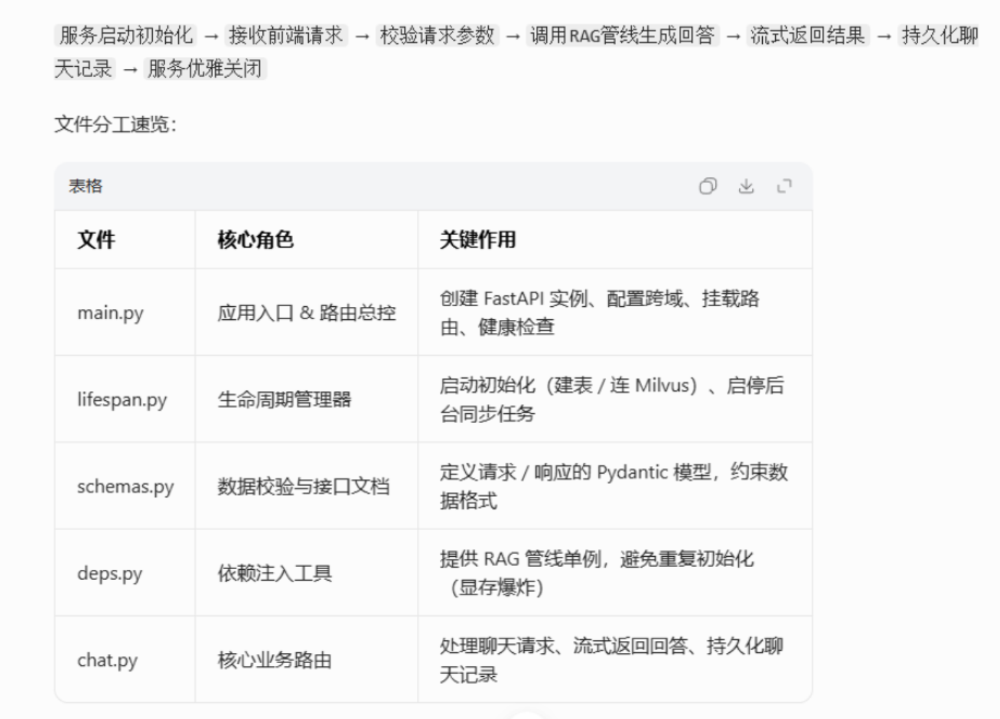
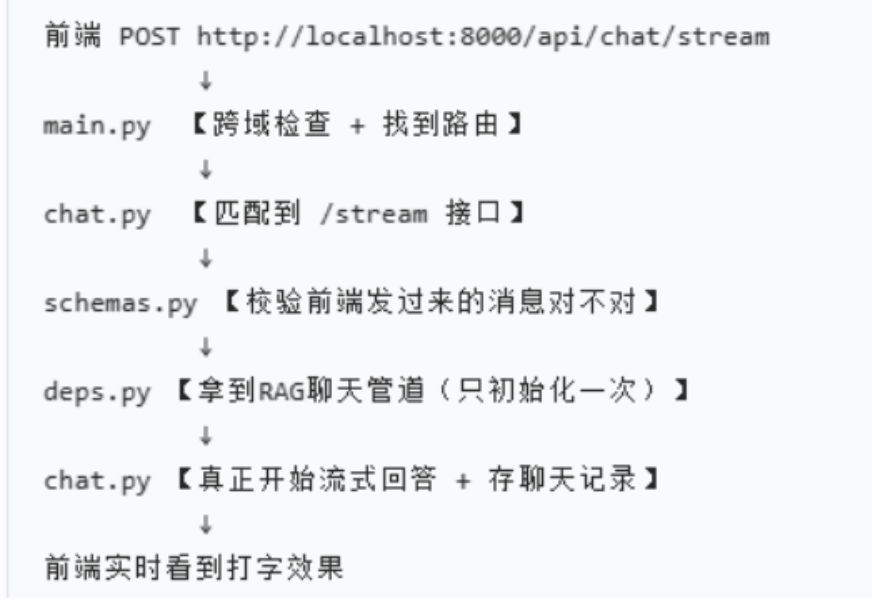

智能问答小易

# 1、项目背景：

基于企业整理的FAQ问答对和长文档文件开发一套RAG智能客服系统，提升用户获取信息的效率，减少客服人力，为企业将本增效。

# 2、项目架构



# 3、FastAPI接口实现链路

## 3.1、各个文件角色



## 3.2、实现链路

### 3.2.1、串联逻辑图

启动阶段：

main.py（创建app） → lifespan.py（建MySQL表→连Milvus→启动后台同步）→ 服务就绪

请求阶段：

前端POST /api/chat/stream → main.py（跨域校验）→ chat.py（路由匹配）→ schemas.py（参数校验）→ deps.py（注入RAG管线）→ chat.py（流式生成回答+持久化）→ 流式返回结果

关闭阶段：

ASGI服务器停止 → lifespan.py（终止后台任务→释放资源）→ 服务优雅退出

### 3.2.2、请求阶段具体实现：



#### 1）前端请求 → 进入 main.py（入口总控）

**请求地址：**`POST ``http://localhost:8000/api/chat/stream`

##### 第一步：main.py 做跨域检查

```Plain
# main.py
app.add_middleware(
    CORSMiddleware,
    allow_origins=settings.cors_origin_list(),
    allow_credentials=True,
    allow_methods=["*"],
    allow_headers=["*"],)
```

✅ **动作：**

- 浏览器先发送跨域预检请求
- 这里**检查前端域名是否合法**
- 通过 → 放行

##### 第二步：main.py 把请求转给 chat.py

```Plain
# main.py 最后一行
app.include_router(chat_router, prefix="/api")
```

✅ **动作：**

- `prefix="/api"` + chat.py 的 `/chat`
- 拼接成：**/api/chat**
- 所以请求 `/api/chat/stream` 会**精准丢给 chat.py**

#### 2）进入 chat.py（接口真正所在地）

```Plain
router = APIRouter(prefix="/chat", tags=["chat"])
```

这行决定了：**所有接口前面自动加 /chat**

精准定位接口：

```Plain
@router.post("/stream")async def chat_stream(
    body: ChatRequest,       # 来自 schemas.py
    pipeline: RagPipeline = Depends(get_pipeline)  # 来自 deps.py):
```

✅ **这就是前端访问的：/api/chat/stream**

#### 3）进入 schemas.py（参数校验  ）

```Plain
body: ChatRequest
```

这个 `ChatRequest` 来自 **schemas.py**

```Plain
class ChatRequest(BaseModel):
    user_external_id: Optional[str] = None
    message: str
```

✅ **动作：**

- FastAPI **自动校验前端传的** **JSON**
- 必须包含 `message`
- 格式不对直接返回 422 错误
- 校验通过 → 继续往下走

#### 4）进入 deps.py（获取 RAG 聊天管道）

```Plain
pipeline: RagPipeline = Depends(get_pipeline)
```

`get_pipeline` 来自 **deps.py**

```Plain
@lru_cache()def get_pipeline() -> RagPipeline:return RagPipeline()
```

✅ **关键点：**

- **全局只创建一次 pipeline**（加载大模型、向量库）
- 后面所有请求都复用它
- 不会重复加载模型 → **不爆****显存**

#### 5）回到 chat.py（真正开始生成回答）

拿到 pipeline 后，执行核心逻辑：

```Plain
async def gen():async for piece in pipeline.stream_chat(...):yield f"data: {json.dumps({'message': piece})}\n\n"
```

✅ **动作：**

1. 调用 RAG 检索知识
2. **逐字返回**给前端（流式输出）
3. 结束后自动保存聊天记录到 MySQL

#### 6）返回给前端（StreamingResponse）

```Plain
return StreamingResponse(gen(), media_type="text/event-stream")
```

✅ **动作：**

- 把生成器逐段发给浏览器
- 前端看到 **AI 逐字打字**

### 3.2.3、关闭阶段具体实现：

**链路：**ASGI服务器停止 → lifespan.py（终止后台任务→释放资源）→ 服务优雅退出

**Ctrl + C** 停止服务：后台服务关闭

**ASGI 服务器**通知 FastAPI 关闭

FastAPI 去执行 `main.py` 里绑定的 **`lifespan=app_lifespan`**

进入 **`lifespan.py`** 的 **`finally`** **关闭块**

**`stop.set()`** 发停止信号

**`task.cancel()`** **+** **`await task`** 等待后台任务安全结束

资源全部释放 → **服务优雅退出**

# 4、评估

## 4.1、准确率评估

### 4.1.1、FAQ

1、FAQ数据准备：问题 、真实答案  

2、评估：问题去提问、ai生成答案-->真实答案   

相似性分数是大于等于0.99    只能是真实答案    相似性分数是大于等于0.85小于0.99：召回1-3条然后总结的答案，需要做相关性打分  85分以上，基本是没问题，如果低于85分，需要人工去看-->同一问题是否对应多个类似答案

### 4.1.2、长文档

1、长文档数据准备：问题（业务准备或算法自己准备-->根据长文档内容） 、真实答案（和问题一样）

2、评估：基于多篇父文档总结的答案-->真实答案   做相关性打分  85分以上   基本是没问题，如果低于85分，需要人工去看-->同一问题是否对应多个类似答案(或先看下面召回率recall@5，尽量在90%以上)

## 4.2、召回率评估

### 4.2.1、FAQ

1、FAQ数据准备：问题 、真实答案    真实答案来源

2、评估：ai生成的答案的来源 -->是否是真实答案来源

### 4.1.2、长文档

1、FAQ数据准备：问题 、真实答案    真实答案来源

2、评估：ai生成的答案的来源（比如取3条作为上下文） -->是否是真实答案来源（在召回的5条上下文内）-->尽量在90%以上

# 5、性能测试

1、首token延迟：模型吐出的第一个字耗时

2、时延：P99、P95 ，举例：

P99=3 秒：99% 用户请求≤3 秒，仅 1% 用户超过 3 秒，体验差。

P95=2 秒：95% 用户≤2 秒，5% 用户更慢。

3、QPS/QPM：每秒/分钟 处理的请求数，建议测试QPM

4、token/s：每秒的吞吐量。每秒模型能生成的token数，代表生成速度快慢（300-500）

5、请求成功 / 失败数 ？